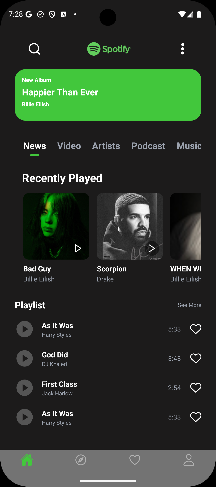

# Spotify Songs API

<p align="right"><a href="#-api-de-músicas-do-spotify">Leia em Português</a></p>



A simple RESTful API built with **Node.js**, **Express**, and **PostgreSQL**. This project serves as a basic backend to manage and retrieve a list of songs, simulating a core feature of a music streaming service.

## ✨ Key Features

- **Songs Endpoint:** Provides a `GET /api/songs` endpoint to retrieve all songs from the database.
- **PostgreSQL Integration:** Uses a robust PostgreSQL database to store and manage song data efficiently.
- **Scalable Backend:** Built with a modern and widely-used stack (Node.js/Express) for easy maintenance and expansion.
- **CORS Enabled:** Ready for integration with any frontend application, allowing cross-origin requests.

## 🛠️ Technologies Used


## 🚀 Getting Started

Follow these instructions to get a copy of the project up and running on your local machine.

### Prerequisites

You need to have [Node.js](https://nodejs.org/) and [PostgreSQL](https://www.postgresql.org/) installed. You will also need to create a database and a `songs` table using the provided `schema.sql`.

### Installation and Execution

1.  **Clone the repository:**

    ```bash
    git clone https://github.com/Buenohy/spotify-api.git
    ```

2.  **Navigate to the project folder:**

    ```bash
    cd spotify-api
    ```

3.  **Install the dependencies:**

    ```bash
    npm install
    ```

4.  **Set up environment variables:**
    Create a `.env` file in the root directory and add your PostgreSQL connection details:

    ```env
    DB_USER=your_postgres_user
    DB_HOST=localhost
    DB_DATABASE=your_database_name
    DB_PASSWORD=your_postgres_password
    DB_PORT=5432
    API_PORT=4000
    ```

5.  **Start the project:**
    ```bash
    npm start
    ```
    The API will be running on `http://localhost:4000`.

## 👨‍💻 Author

Made with ❤️ by **Gabriel Bueno Hygino**

## ⚖️ License

This project is licensed under the ISC License. See the [LICENSE](LICENSE) file for more details.

---

# API de Músicas do Spotify

<p align="right"><a href="#-spotify-songs-api">Read in English</a></p>


Uma API RESTful simples construída com **Node.js**, **Express** e **PostgreSQL**. Este projeto serve como um backend básico para gerenciar e buscar uma lista de músicas, simulando uma funcionalidade central de um serviço de streaming de música.

## ✨ Principais Funcionalidades

- **Endpoint de Músicas:** Fornece um endpoint `GET /api/songs` para buscar todas as músicas do banco de dados.
- **Integração com PostgreSQL:** Utiliza um banco de dados PostgreSQL robusto para armazenar e gerenciar os dados das músicas de forma eficiente.
- **Backend Escalável:** Construído com uma stack moderna e amplamente utilizada (Node.js/Express) para fácil manutenção e expansão.
- **CORS Habilitado:** Pronto para integração com qualquer aplicação frontend, permitindo requisições de origens diferentes.

## 🛠️ Tecnologias Utilizadas


## 🚀 Como Executar

Siga estas instruções para obter uma cópia do projeto em execução na sua máquina local.

### Pré-requisitos

Você precisa ter o [Node.js](https://nodejs.org/) e o [PostgreSQL](https://www.postgresql.org/) instalados. Você também precisará criar um banco de dados e uma tabela `songs` usando o arquivo `schema.sql` fornecido.

### Instalação e Execução

1.  **Clone o repositório:**

    ```bash
    git clone https://github.com/Buenohy/spotify-api.git
    ```

2.  **Acesse a pasta do projeto:**

    ```bash
    cd spotify-api
    ```

3.  **Instale as dependências:**

    ```bash
    npm install
    ```

4.  **Configure as variáveis de ambiente:**
    Crie um arquivo `.env` no diretório raiz e adicione suas credenciais de conexão do PostgreSQL:

    ```env
    DB_USER=seu_usuario_postgres
    DB_HOST=localhost
    DB_DATABASE=nome_do_seu_banco
    DB_PASSWORD=sua_senha_postgres
    DB_PORT=5432
    API_PORT=4000
    ```

5.  **Inicie o projeto:**
    ```bash
    npm start
    ```
    A API estará rodando em `http://localhost:4000`.

## 👨‍💻 Autor

Feito com ❤️ por **Gabriel Bueno Hygino**

## ⚖️ Licença

Este projeto está sob a licença ISC. Veja o arquivo [LICENSE](LICENSE) para mais detalhes.
